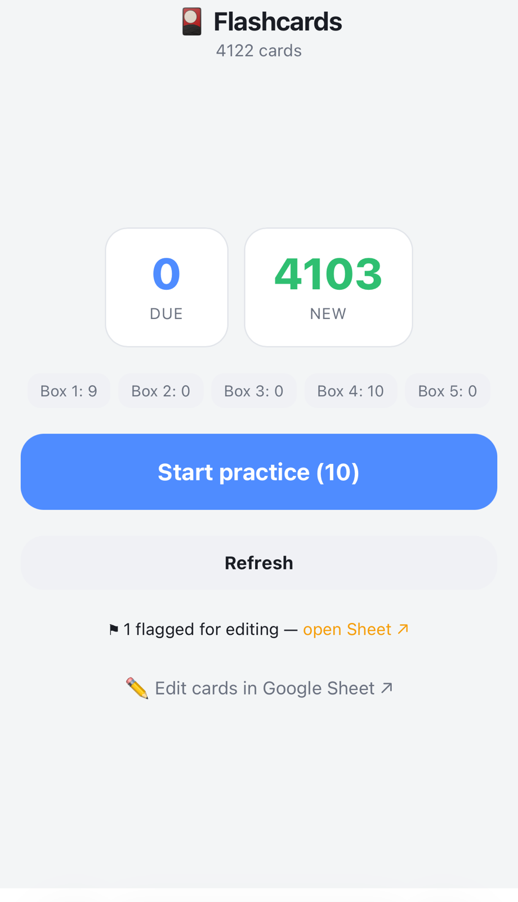
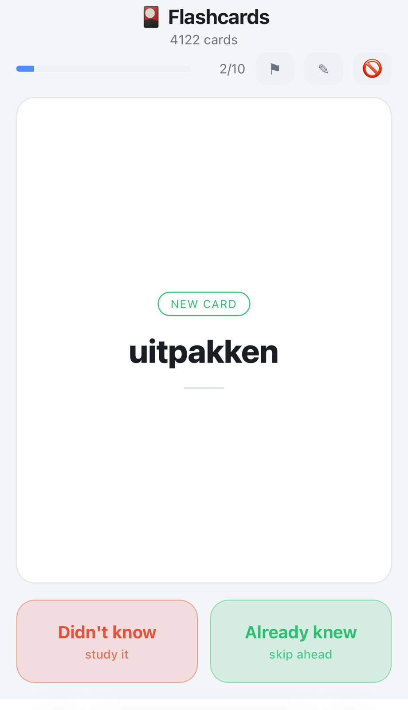

# 🎴 Flashcards

A mobile-first flashcard web app backed by a **Google Sheet**. Practice any deck
with simple **Leitner** spaced repetition, on your phone, tablet, or laptop. Card
text supports **Markdown**. No server to host and no database to run — the Google
Sheet *is* the database, and Google Apps Script serves the app.

- **Backend:** a Google Sheet (`cards` tab). Add/edit cards from anywhere.
- **App:** a single Apps Script web app (mobile-first, add-to-home-screen friendly).
- **Scheduling:** Leitner boxes (1→5), with immediate write-back of your progress.
- **Speech:** tap 🔊 to hear a word or example in the language you're studying —
  your browser's own voices, no API key, no cost. Plus a **hands-free 🎧 autoplay**
  mode that reads cards to you while you cook or commute.
- **In-app tools:** edit a card, flag it for later, or exclude a bad card — all
  saved straight to the Sheet.

> This repo is a **template** — deploy your own copy against your own Google
> account and Sheet (see below). It ships with a small Dutch A1/A2 starter deck,
> but the app is language-agnostic: set `target_language` in the `config` tab and
> it's a Chinese (or French, or Japanese) app instead. Use it for anything.

**📋 [Example Sheet — make a copy to get your own][example-sheet]** (Dutch A1/A2
starter deck, app code included). Copying it is the fastest way to start: you get
the Sheet *and* the app in one click, no CLI. See [Deploy your own](#deploy-your-own).

[example-sheet]: https://docs.google.com/spreadsheets/d/1XH4yAlpc0ahMKJP1JFcWsIpR_ATThbHTC9qAmDSiDoc/copy

## Screenshots

<p align="center">
  
  &nbsp;&nbsp;
  
</p>

## Why this instead of a flashcard app?

- **Lightweight — it's just a web page.** Nothing to install or update; it runs
  in the browser you already have, on any device (phone, tablet, laptop). No
  app-store download, no account for yet another service, no sync engine to trust.
- **No ads, no upsells — ever.** Because you self-host it (your own Apps Script
  web app + your own Google Sheet), there's no company in the middle with a
  reason to show you ads, gate features behind a subscription, or mine your
  study data. It's yours end to end.
- **Your browser's superpowers come for free.** Since it's a normal web page,
  you can **select any word to look it up, translate, or search**, use
  right-click / long-press actions, share a card, or use any browser extension
  or accessibility feature you rely on — none of which a locked-down native app
  lets you do.
- **Flexible, dead-simple editing.** Your cards live in a **Google Sheet**, so
  you can bulk-**import** a deck, tweak wording, fix a typo, add rows, or
  reorganize columns whenever you want — from the Sheet on any device, or from
  inside the app while you study. No proprietary format, no export/re-import
  dance; the spreadsheet *is* the database.
- **Quiet by design — no notifications, no gamification.** It will never buzz
  your phone with reminders you're already drowning in, and there are no
  streaks, badges, XP, or leaderboards engineered to keep you hooked. It simply
  shows what's due and gets out of the way. It runs on *your* motivation — not
  manufactured guilt or dopamine loops.

## Deploy your own

Two ways to get your own copy. Either way it ends up **entirely yours** — your
Sheet, your script, your Google account. Nothing reports back here.

### Option A — copy the example Sheet (no CLI) — recommended

A Google Sheet copy includes its bound Apps Script project, so this gets you the
deck *and* the app in one step. You need only a Google account.

1. **[Make a copy of the example Sheet][example-sheet]** — this lands a
   *Flashcards* Sheet in your own Drive, starter deck and code included.
2. Make the copy yours: in the **`config`** tab, clear the **`webapp_url`** cell
   so the app resolves to *your* own deployment instead of the original's.
   (Optional: to wipe the starter progress and study from scratch, clear the
   `box`, `due`, `last_seen`, `right`, `wrong` and `flag` columns in the `cards`
   tab.)
3. Open **Extensions → Apps Script**.
4. Click **Deploy → New deployment**, choose type **Web app**, set *Execute as*
   **Me** and *Who has access* **Only myself**, then **Deploy**.
5. **Authorize** when prompted. It's your own script now, so the "Google hasn't
   verified this app" warning is expected — click *Advanced → Go to Flashcards*.
6. Open the web-app URL it gives you. On iOS, tap **Share → Add to Home Screen**
   for an app-like icon.
7. Studying something other than Dutch? Set **`target_language`** in the
   **`config`** tab (see [Settings](#settings-config-tab)).

The starter deck comes with the copy, so you can skip the seeding step. To start
from an empty deck instead, clear the rows under the header in the `cards` tab
(or use **🎴 Flashcards → Reset & reseed** to get the starter deck back).

### Option B — deploy from this repo with clasp

Choose this if you want the code in git and plan to change it.

> **Using a coding agent?** See [`AGENTS.md`](./AGENTS.md) — it walks the same
> deploy split into agent-runnable commands and the three browser steps Google
> requires you (the human) to do: `clasp login`, enabling the Apps Script API,
> and the first-run authorization. The manual steps below are the human version.

You'll need [Node.js](https://nodejs.org) and a Google account.

1. **Install clasp** (Google's Apps Script CLI) and log in:
   ```bash
   npm install -g @google/clasp
   clasp login
   ```
   Also enable the Apps Script API for your account at
   <https://script.google.com/home/usersettings>.

2. **Create a Sheet-bound script project** (do this in a clone of this repo):
   ```bash
   clasp create --type sheets --title "Flashcards" --rootDir .
   ```
   This creates a new Google Sheet + bound script and writes a local
   `.clasp.json`. Note: `clasp create` overwrites `appsscript.json` with a
   default — restore this repo's version afterward (it sets the web-app access
   and timezone).

3. **Push the code and deploy as a web app:**
   ```bash
   clasp push --force
   clasp deploy --description "v1"
   ```
   The `deploy` command prints a deployment ID; your web-app URL is
   `https://script.google.com/macros/s/<DEPLOYMENT_ID>/exec`.

4. **Load the starter deck:** open your new Sheet and click **🎴 Flashcards →
   Load starter deck** (the menu is added automatically when the Sheet opens).
   Authorize when prompted — it's your own script, so the "unverified" warning
   is expected.

5. **Use it:** open the web-app URL, and on iOS tap **Share → Add to Home
   Screen** for an app-like icon.

To redeploy after changes, reuse the same deployment ID so the URL (and your
Home Screen icon) stays stable:
```bash
clasp push --force
clasp redeploy <DEPLOYMENT_ID> --description "..."
```

### Access model
Set the web app's access in `appsscript.json` (`webapp.access`):
`MYSELF` (only you — every browser must be signed into the owning account),
`ANYONE` (anyone with a Google account), or `ANYONE_ANONYMOUS` (anyone with the
link). The app always runs as the deploying user and only ever touches that
user's own Sheet.

## How to use it

- Home shows **Due** / **New** counts and the Leitner box breakdown, with two ways
  to study:
  - **Start practice** — the scheduled Leitner session (all due cards + up to 10 new
    ones). Grading **saves your progress** to the Sheet.
  - **Practice weak cards** — a free drill of your weakest cards (lowest Leitner
    boxes first, so a word you just missed shows up first). This is
    **schedule-neutral: grading does *not* change any card's box or due date** — use
    it to hammer shaky words as often as you like without disturbing your schedule.
    Tap **Keep going** on the summary to pull a fresh batch.
- Each card shows the **front** first. Tap it (or **Show answer**) to reveal the
  **back** + any **notes**. Revealing also speaks the example aloud — see
  [Hearing your cards](#hearing-your-cards-).
- Grade yourself:
  - Normal card: **Wrong** (back to box 1) or **Correct** (up one box).
  - Brand-new card: **Didn't know** (box 1) or **Already knew** (skip to box 4).
- In a scheduled session, progress saves to the Sheet immediately after each grade.
  In a weak-card drill, nothing about the schedule is written.
- The **✎ edit / ⚑ flag / 🚫 exclude** tools save straight to the Sheet in **both**
  modes (they change a card's content, not its schedule).

### Card tools while you practice
Each card has four tools in the progress row (top right):

- **🔊 Speak** — hear the card in the language you're studying. Works before or
  after revealing (after, it reads the example sentence too).
- **✎ Edit** — edit the card's front / back / notes (Markdown) and **Save to
  Sheet** — written back immediately. Works on phone and laptop.
- **⚑ Flag** — one tap marks the card (writes `⚑` to its `flag` column) so you
  can fix it later without stopping to type. Tap again to un-flag. Filter the
  `flag` column in the Sheet to find flagged cards.
- **🚫 Exclude** — drops a bad/low-quality card from all future practice
  (soft-delete: writes `x` to its `exclude` column) and skips to the next card.
  Reversible — clear the `exclude` cell to bring it back, or filter that column
  to bulk-delete those rows when cleaning up.

## The Sheet schema (`cards` tab)

| column | meaning |
|--------|---------|
| `id` | any unique value |
| `type` | optional tag/category (e.g. `vocab`, `grammar`) — shown on the card badge |
| `front_side` | front of the card — **Markdown** |
| `back_side` | back of the card (the answer) — **Markdown** |
| `notes` | optional hint shown under the answer — **Markdown** |
| `box` | Leitner box 1–5. **Leave blank = new card** |
| `due` | next review date `YYYY-MM-DD` (managed by the app) |
| `last_seen`, `right`, `wrong` | stats (managed by the app) |
| `added` | date reference (your own) |
| `flag` | holds `⚑` when flagged in the app for later editing |
| `exclude` | holds `x` when excluded from practice (soft-delete) |

The app self-heals the schema: on first load it adds any missing columns
(`flag`, `exclude`) without touching your data. It does the same for the
[`config` tab](#settings-config-tab), so both tabs appear on their own.

### Adding your own cards
Add a row to the `cards` tab (laptop or phone). Fill `front_side`, `back_side`,
optionally `type` and `notes`. **Leave `box`/`due` empty** so it appears as a
new card. You can hand-tune proficiency any time by editing `box` and `due`.

To bulk-add a whole deck from a CSV, tap **＋ Import cards from a file** on the
home screen — it walks you through Google Sheets' own **File → Import** (a
laptop/desktop step; the Sheets mobile app can't import). The one setting that
matters there is **“Convert text to numbers, dates, and formulas” → No**, or
Google turns entries like `1/2` into dates.

### Markdown
`front_side`, `back_side`, and `notes` render Markdown: `**bold**`, `_italic_`,
`` `code` ``, `# headings`, `- bullet lists`, `1.` numbered lists, `[links](https://…)`,
and ``. Put line breaks in a cell with **Alt+Enter**
(Option+Enter on Mac) inside the Google Sheet.

## Settings (`config` tab)

Most of these you can change **right in the app** — tap the **⚙** in the top-right,
pick your language (the list is built from the voices your device actually has),
speed and auto-speak, and Save. No need to touch the Sheet.

Under the hood they live in a second tab called **`config`**, as `key` / `value`
rows, so you can also edit a cell and reload. The tab is created automatically with
sensible defaults the first time the app runs, so there's nothing to set up.

| key | default | what it does |
|-----|---------|--------------|
| `target_language` | `nl-NL` | **The language you're studying.** A [BCP-47](https://en.wikipedia.org/wiki/IETF_language_tag) tag — `zh-CN`, `fr-FR`, `de-DE`, `es-ES`, `ja-JP`… |
| `speech_rate` | `0.9` | Speaking speed. `0.5` = slow, `1` = normal. |
| `auto_speak` | `yes` | Speak the example automatically when you reveal an answer? `yes` / `no` |
| `autoplay_speak` | `translate` | Hands-free mode: `translate` (word → meaning → example) or `target` (word + example only). |
| `native_language` | *(blank)* | Your own language, for spoken meanings in hands-free `translate` mode. Blank = use your device's language. |
| `webapp_url` | *(blank)* | The `/exec` link of your deployment, used by **🎴 Flashcards → Open the app ↗**. Blank = auto-detect. |

## Hearing your cards 🔊

Tap **🔊** in a card's tool row to hear it, and the example sentence plays
automatically when you reveal an answer (turn that off with `auto_speak`).

### Hands-free autoplay 🎧
Tap **🎧 Autoplay (hands-free)** on the home screen for an eyes-free listening
drill — good for the kitchen, a walk, or a commute. It plays through your cards
aloud and advances on its own, looping in random order until you stop, and it
holds the screen awake so playback isn't cut off. Grades aren't recorded (you're
not looking), so it never changes your schedule.

Two styles, set in **⚙ Settings** (or the `autoplay_speak` key):
- **Word → meaning → example** — the word, a pause to recall it, then the meaning
  in your own language, then the example. Set **your language** in Settings too.
- **Target language only** — just the word and its example, for immersion.

> **It needs the screen on and the app in front.** Phone browsers (iOS especially)
> stop speech when the screen locks or you switch apps — a Web Speech limitation,
> not a setting. So prop the phone up with the screen on; true pocket/locked-screen
> playback isn't possible without pre-recorded audio.

### Speech
Speech uses your browser's built-in voices — nothing is sent anywhere, there's no
API key, and it costs nothing. **Only the language you're studying is ever spoken:**
the `front_side`, plus any *italic* example sentences in `back_side` / `notes`. Your
own-language gloss (the **bold** part) stays silent — you don't need it read to you.
So write cards with a **bold gloss** and an _italic example_ and speech does the
right thing on its own.

> **Set `target_language` first.** It ships as `nl-NL` because the starter deck is
> Dutch. If your cards are in another language, change it — a Dutch voice handed
> Chinese cards can't pronounce a single character and just says *"punt"* ("dot").
> The home screen always shows what it's set to (**🔊 Dutch (nl-NL)**), and the app
> refuses to speak rather than produce nonsense if the two obviously disagree.

> **Voice quality is your device's, not the app's.** iPhone and iPad are good out of
> the box, and *Settings → Accessibility → Spoken Content → Voices* lets you download
> a higher-quality voice for your language. On macOS, add voices in *System Settings →
> Accessibility → Spoken Content*. If nothing is installed for your language the app
> tells you instead of speaking it in the wrong voice.

## Scheduling (Leitner)

- Boxes **1→5**, review intervals **1, 2, 4, 8, 16 days**.
- **Correct** → up one box. **Wrong** → back to box 1.
- Up to **10 new cards** per scheduled session.
- **Practice weak cards** drills the lowest boxes and is **schedule-neutral** — it
  never changes a card's box or due date. Up to **20 cards** per drill.
- Tune in `Code.js`: `BOX_INTERVALS`, `NEW_PER_SESSION`, `KNOWN_START_BOX`,
  `PRACTICE_LIMIT`.

## Project files

| file | purpose |
|------|---------|
| `Code.js` | backend: `doGet`, Leitner logic, sheet I/O, the `getSession`/`getWeakCards`/`gradeCard`/`updateCard` API |
| `Index.html` | the entire UI — inline CSS/JS + a small Markdown renderer |
| `Seed.js` | starter deck + `seedCards` / `resetAndReseed` |
| `appsscript.json` | Apps Script manifest (timezone + web-app access) |
| `.claspignore` | limits what clasp pushes to the script |
| `.claspignore.public`, `push-public.sh` | maintainer-only: sync this repo to the [example Sheet][example-sheet]'s script. Not needed to run or deploy the app — ignore them in your own copy. |

## License

[MIT](./LICENSE).
